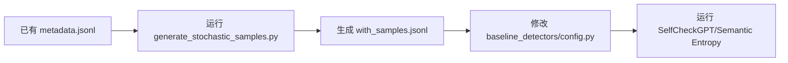

# 多次采样功能快速上手指南 🚀

## 📦 已创建的文件

在 `/home/zfang1/Data/Lxy/Benchmark/data/` 目录下：

1. **`generate_stochastic_samples.py`** - 核心采样生成器
2. **`run_sampling_example.sh`** - 便捷运行脚本
3. **`test_sampling.py`** - 快速测试脚本
4. **`README_SAMPLING.md`** - 详细使用文档
5. **`SAMPLING_QUICKSTART.md`** - 本文件（快速上手）

---

## ⚡ 30 秒快速开始

### 步骤 1：测试功能是否正常

```bash
cd /home/zfang1/Data/Lxy/Benchmark/data

# 运行快速测试（2 个样本 × 3 次采样）
python test_sampling.py
```

**预期输出**：
```
✅ 测试通过！可以在真实数据上使用了。
```

---

### 步骤 2：在真实数据上运行

```bash
# 方式 A：使用示例脚本（推荐）
# 1. 编辑配置
vim run_sampling_example.sh

# 2. 修改这些行：
#    INPUT_FILE="你的数据路径"
#    OUTPUT_FILE="输出路径"
#    MODEL_NAME="你的模型"
#    NUM_SAMPLES=10

# 3. 运行
./run_sampling_example.sh
```

```bash
# 方式 B：直接命令行
python generate_stochastic_samples.py \
    --input experiments/Qwen/Qwen3-8B/coqa_5000samples/03_final_scored_metadata.jsonl \
    --output experiments/Qwen/Qwen3-8B/coqa_5000samples/03_with_samples.jsonl \
    --model Qwen/Qwen3-8B \
    --num-samples 10 \
    --temperature 0.8 \
    --trust-remote-code \
    --resume
```

---

## 📊 参数选择建议

| 场景 | num-samples | temperature | 说明 |
|------|------------|-------------|------|
| 🧪 **测试** | 3-5 | 0.7 | 快速验证功能 |
| 🎯 **SelfCheckGPT** | 5-10 | 0.8 | 平衡质量与速度 |
| 🌡️ **Semantic Entropy** | 10-20 | 0.9-1.0 | 需要高多样性 |
| 🏭 **生产环境** | 10 | 0.8 | 推荐配置 |

---

## 📁 输出文件格式

生成的文件在原有基础上新增 `stochastic_samples` 字段：

```json
{
    "sample_id": "coqa_train_000000",
    "prompt": "...",
    "model_output_text": "Paris",
    "stochastic_samples": [
        "Paris",
        "The capital of France is Paris.",
        "Paris is the capital.",
        ...
    ]
}
```

---

## 🔗 与 Baseline Detectors 集成

### 1. 修改配置文件

```python
# baseline_detectors/config.py

METADATA_JSONL = os.path.join(
    EXPERIMENT_DIR,
    "03_with_samples.jsonl"  # ✨ 使用包含采样的文件
)
```

### 2. 直接使用

```python
# 在 detector 中自动可用
samples = accessor.get_stochastic_samples()
print(f"获得 {len(samples)} 个采样")
```

---

## ⏱️ 预计耗时

基于 Qwen-8B + A100：

- 100 样本 × 10 次采样 ≈ **10 分钟**
- 1000 样本 × 10 次采样 ≈ **1.5 小时**
- 5000 样本 × 10 次采样 ≈ **7 小时**

**优化建议**：
- 使用 `--resume` 支持断点续传
- 先在小数据集测试
- 夜间或周末运行大规模采样

---

## 🛠️ 常见问题速查

### Q: 程序中断了怎么办？
**A**: 加上 `--resume` 参数重新运行，会从断点继续

### Q: 显存不足？
**A**: 降低模型大小或使用 CPU (`--device cpu`)

### Q: 采样质量不好？
**A**: 调整 `--temperature`（0.7 更保守，0.9 更多样）

### Q: 速度太慢？
**A**: 减少 `--num-samples` 或使用更小的模型

---

## 📝 完整工作流程



```bash
# 1. 生成采样
python generate_stochastic_samples.py \
    --input experiments/.../03_final_scored_metadata.jsonl \
    --output experiments/.../03_with_samples.jsonl \
    --model Qwen/Qwen3-8B \
    --num-samples 10 \
    --trust-remote-code \
    --resume

# 2. 修改 baseline_detectors 配置
cd ../baseline_detectors
vim config.py  # 修改 METADATA_JSONL

# 3. 运行 detector
python runner.py
```

---

## 🎯 下一步

1. ✅ **测试功能**：运行 `python test_sampling.py`
2. ✅ **小规模验证**：在 100 个样本上测试
3. ✅ **全量生成**：使用 `--resume` 生成完整数据
4. ✅ **实现 Detector**：开发 SelfCheckGPT 等方法

---

## 📞 需要帮助？

查看详细文档：`README_SAMPLING.md`

---

**创建时间**: 2026-03-19
**版本**: 1.0
